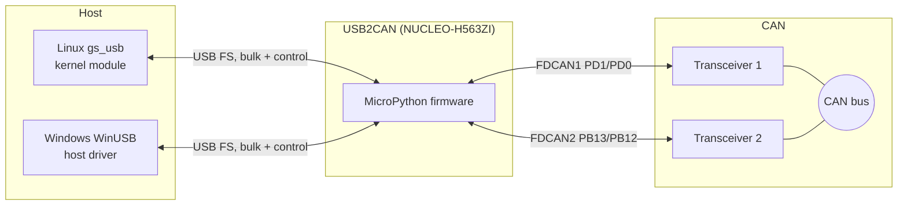
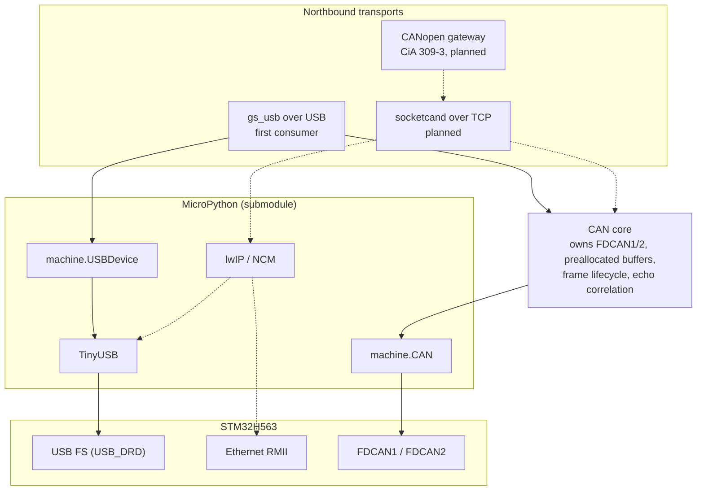
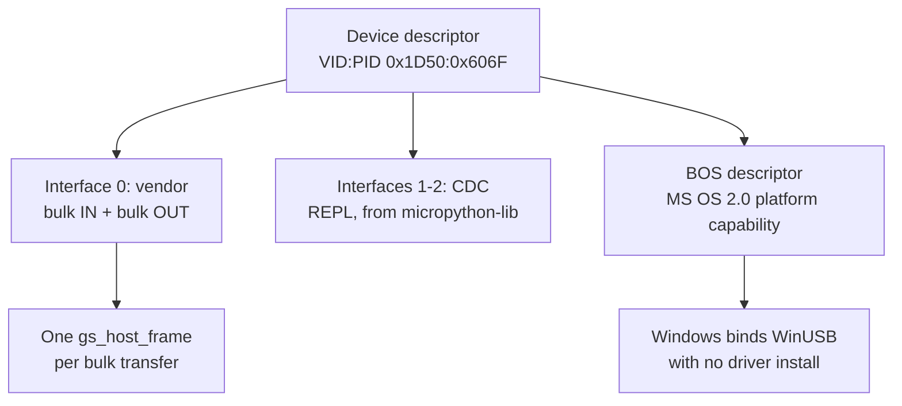
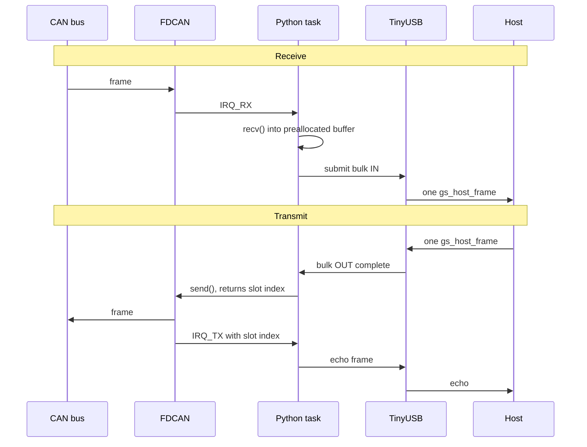
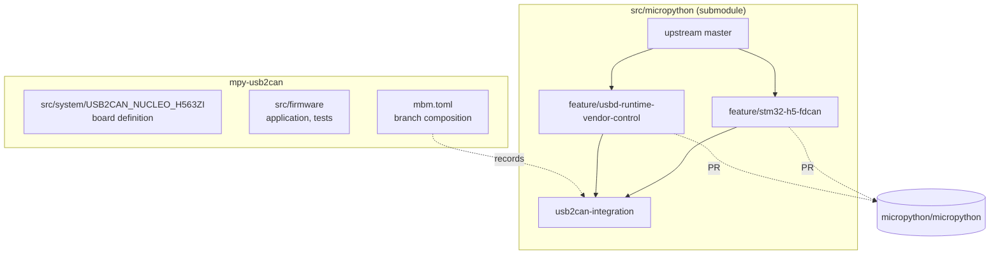

# Architecture

`mpy-usb2can` is USB-CAN adapter firmware written in MicroPython for the
STM32H563. It presents the `gs_usb` protocol so that the mainline Linux
`gs_usb` kernel module and candleLight-compatible hosts drive it without a
vendor driver, and binds driverless on Windows through WinUSB.

This document describes the system as designed. Sections marked **Not yet
built** state what is currently absent, so the document can be read against
the code without surprises.

## Scope

Classic CAN is the deliverable. The hardware and the wiring are CAN-FD
capable and the frame codecs handle FD framing, but FD operation is deferred.

## System context

The device is a translator with a host on one side and a CAN bus on the other.
Nothing above the USB boundary is ours: the value of speaking `gs_usb` is that
existing hosts already know the protocol.

The Nucleo has no transceiver fitted, so one external transceiver per channel
is required. Both CAN pin pairs are AF9.

## Firmware layers

The firmware is Python frozen into the MicroPython build, sitting on two
runtime APIs the port provides in C.

One component owns the CAN controllers, the preallocated frame buffers and the
frame lifecycle. Transports attach to it as consumers. `gs_usb` is the first
consumer, not the owner: that factoring is what lets a network transport be
added later without a second implementation racing for the same controller.

Dotted edges are unbuilt. The CAN core, the gs_usb protocol codec, control
plane, data plane and USB device layer all exist and are unit-tested on the
unix port. **Nothing wires them together yet**: the application still starts
the template's LED demo and instantiates none of them, so no two of these
components have run together on hardware. That composition is the next piece of
work, and it is what turns a library into a device.

Two constraints govern any added transport. It must not alter the gs_usb wire
contract or its conformance behaviour, and where two transports could drive the
same channel at once, the arbitration is an explicit decision rather than an
emergent one. Bandwidth is the practical limit rather than endpoints: a
composite of gs_usb, the CDC REPL and NCM uses six of eight endpoint numbers
and fits the 2048-byte packet memory, but NCM shares the Full Speed bus with
gs_usb, while Ethernet is a separate PHY.

### Why TinyUSB

The board sets `MICROPY_HW_TINYUSB_STACK`, selecting TinyUSB over the legacy
ST usbdev stack. That is what provides `machine.USBDevice`, which lets the USB
descriptors and endpoint handling be written in Python. It also compiles out
`usb.c` and with it `pyb.usb_mode()`.

## USB interface composition

The Linux driver matches `gs_usb` at `bInterfaceNumber 0` only, so the vendor
interface must be first. MicroPython's built-in CDC always claims interface 0,
which means the two cannot coexist: keeping a REPL requires the built-in
driver disabled and a Python CDC placed after the vendor interface.

Both channels are multiplexed over the single bulk endpoint pair and
distinguished by a channel field in the host frame, so a second channel costs
no endpoints.

The descriptors are written and their structure is tested by walking the
byte stream as a host would. Both prerequisite C changes exist on branches
tracked by `mbm.toml`: vendor control transfers now reach Python, and a BOS
descriptor can be served. **Neither has been exercised on the bench**, so the
claim that a vendor request reaches Python is still a reading of the source
rather than an observation.

## Frame paths

Receive and transmit are separate paths with different constraints.

The transmit echo is deliberately deferred until `IRQ_TX` reports the slot
complete, which is on-bus transmission rather than acceptance into the
peripheral. Upstream candleLight echoes on acceptance; echoing on completion
gives the host a truthful transmit confirmation.

### Constraints that shape these paths

The mainline kernel driver sizes its URBs to a single `gs_host_frame` and does
not parse multiple frames from one transfer. One CAN frame therefore costs one
USB transaction in each direction, with no batching available, so throughput is
bounded by USB transactions per second rather than by bandwidth. On Full Speed
that ceiling is close to a saturated 1 Mbit/s classic bus.

Two consequences follow. Every frame crossing the boundary must avoid heap
allocation, because a GC pause during a burst drops frames; buffers are
preallocated and passed as `memoryview`. And the FDCAN receive FIFOs are three
elements deep per instance, fixed in hardware, which leaves little slack if the
Python side is late.

The CAN half of that question is measured: pure Python moves 8847 frames/s at
1 Mbit and 4423 at 500 kbit with zero allocation, both about 98% of what the
wire itself carries, so the bus is the constraint rather than Python. The USB
half is not measured and needs a runtime vendor device to measure. The fallback,
if it is needed, is a C class driver for the data path with the control plane
staying in Python.

One controller behaviour shapes the transmit path. A frame whose CAN identifier
is already pending is refused even when the queue has room, because the driver
preserves transmit order against the controller's identifier arbitration. A
gs_usb adapter meets this constantly, since a CANopen master transmits
repeatedly on one identifier. Overriding it buys a few per cent the bus cannot
use, so the ordering is kept.

## Repository layout

The firmware repo holds the board definition and application. MicroPython is a
submodule pinned to an integration branch that composes changes bound for
upstream, so no patch is carried silently.

Each branch is a self-contained upstream contribution. As a PR merges, its
branch is dropped from the composition rather than carried forever.

## Build and test

Builds run in `micropython/build-micropython-arm`, the official toolchain
container. The version is resolved on the host by git-versioner and passed in
through `MICROPY_GIT_TAG`, so the image needs no project-specific packages.
The application links at `0x08008000` and requires mboot at `0x08000000`;
flashing the application alone leaves an empty vector table and the CPU locks
up at reset.

Testing has three tiers. Protocol logic is pure software and runs on the unix
port in CI. Controller behaviour runs on the board in internal loopback, which
needs no transceiver. Bus behaviour needs transceivers and a second node, and
conformance is judged by whether a stock Linux kernel drives the device
unmodified, which is the one oracle we did not write.
